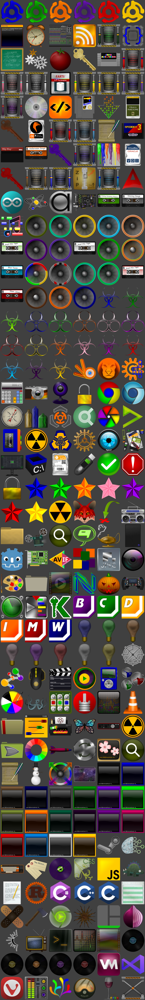

m0dw3rks-Icons [ m0dw3rks.com ] My personal icons primarily for mimetypes and uncommon applications.

Right now the state of the set is incomplete. There are lots of included icons that are uninspired or "roughed in" for now. I design things to fit what it represents rather than adhering to a cohesive style.

Icons from 16x16 to 512x512. While I typically focus on things I use there is already a lot of things I don't use covered and I add to the collection rather frequently. I've removed the scalable simply because files that have text have not been converted to paths (for now.) Below is a preview of some of the icons.

CC BY-NC-ND 4.0

<h1>Installation</h1>
Unzip / Decompress to either ~/.local/share/icons or /usr/share/icons for system wide use.
You may want to alter the index.theme file and set the Inherits value to your preferred fallback icon set to fill in potential gaps.
